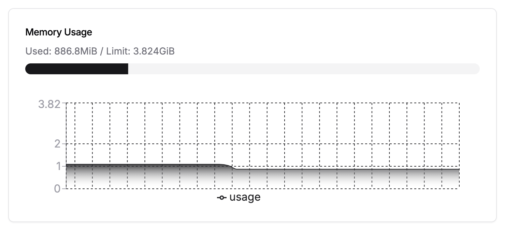
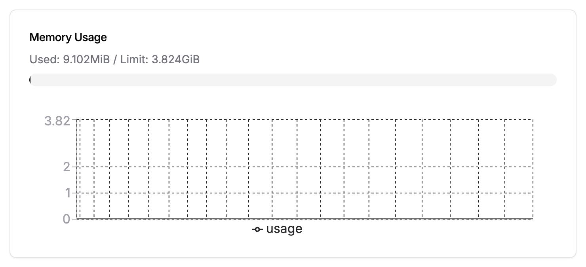

# MiniMax Gateway

Lightweight OpenAI-compatible gateway for MiniMax with per-user API keys and a sliding request window.

## Why This Exists

LiteLLM is a strong general-purpose gateway, but for this narrow use case it was heavier than necessary on a small Dokploy host. In practice, the LiteLLM proxy stack can end up consuming memory in the gigabyte range once its full runtime dependencies are involved.

This service exists for a simpler goal: keep a personal MiniMax upstream key private, issue separate gateway keys to friends, and enforce per-key quotas while keeping the deployment footprint in the megabyte range instead of gigabytes.

It also solves a product requirement that mattered for this setup: a strict per-key quota over a 5-hour window. LiteLLM exposes TPM and RPM style controls, but that is not the same as a subscription-style request cap for MiniMax. This gateway implements the exact limit needed here: requests per user key over a sliding 5-hour window.

## Dokploy Memory Comparison

These screenshots come from Dokploy Monitoring on the same host. They are point-in-time measurements, not hard guarantees, but they show why this narrower service exists.

| LiteLLM before | MiniGateway after |
| --- | --- |
|  |  |
| LiteLLM proxy at about `886.8 MiB` | MiniGateway at about `9.1 MiB` |

## Features

- `GET /v1/models`
- `POST /v1/chat/completions`
- `POST /v1/responses` mapped to upstream chat completions
- `POST /admin/keys` for issuing personal API keys
- `POST /admin/keys/disable` for revoking keys
- SQLite-backed sliding window rate limit per key

## Environment

- `UPSTREAM_API_KEY` - required upstream provider key
- `ADMIN_TOKEN` - required admin bearer token
- `REQUEST_LIMIT` - default `1000`
- `WINDOW_SECONDS` - default `18000`
- `DATABASE_PATH` - default `/data/gateway.db`
- `UPSTREAM_BASE_URL` - default `https://api.minimax.io/v1`
- `UPSTREAM_MODELS` - comma-separated allowed model list

## Admin API

Create a personal key:

```bash
curl -X POST "$BASE_URL/admin/keys" \
  -H "Authorization: Bearer $ADMIN_TOKEN" \
  -H "Content-Type: application/json" \
  -d '{"alias":"alex"}'
```

The response includes the generated `api_key` once. Store it after creation.

## Run locally

```bash
export UPSTREAM_API_KEY=...
export ADMIN_TOKEN=...
go run .
```
